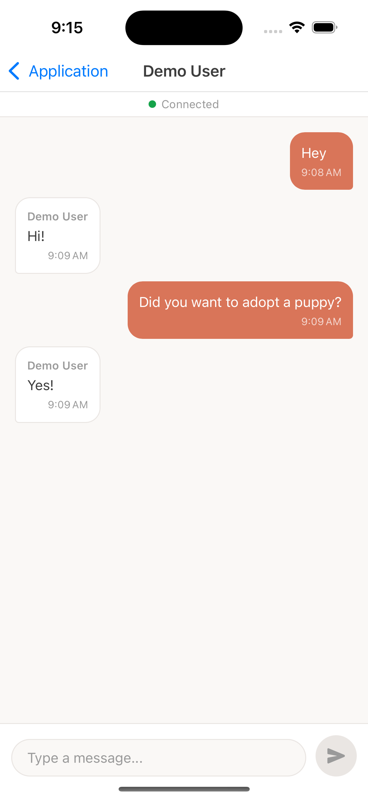
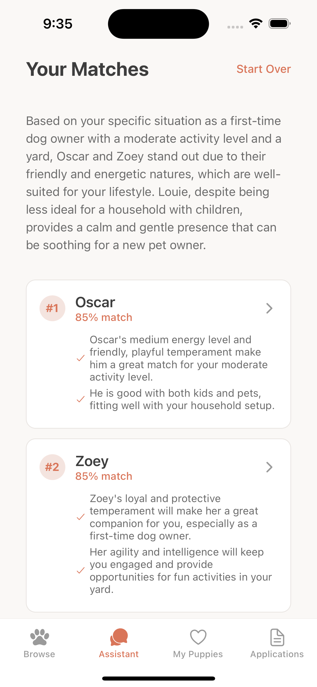
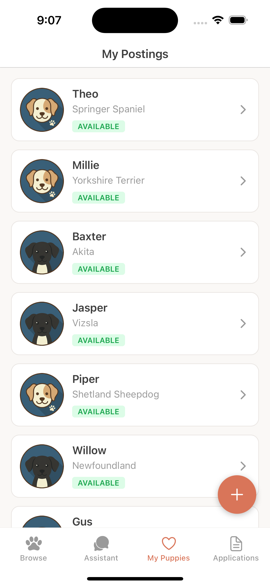
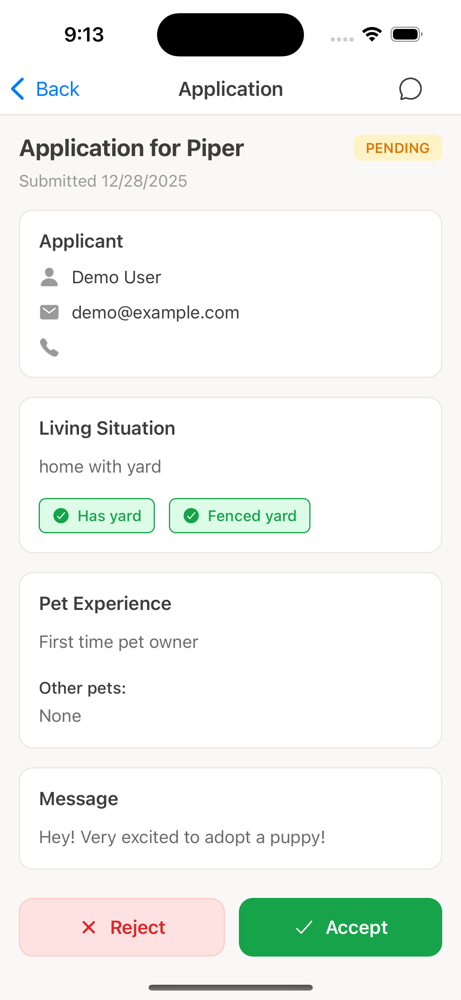
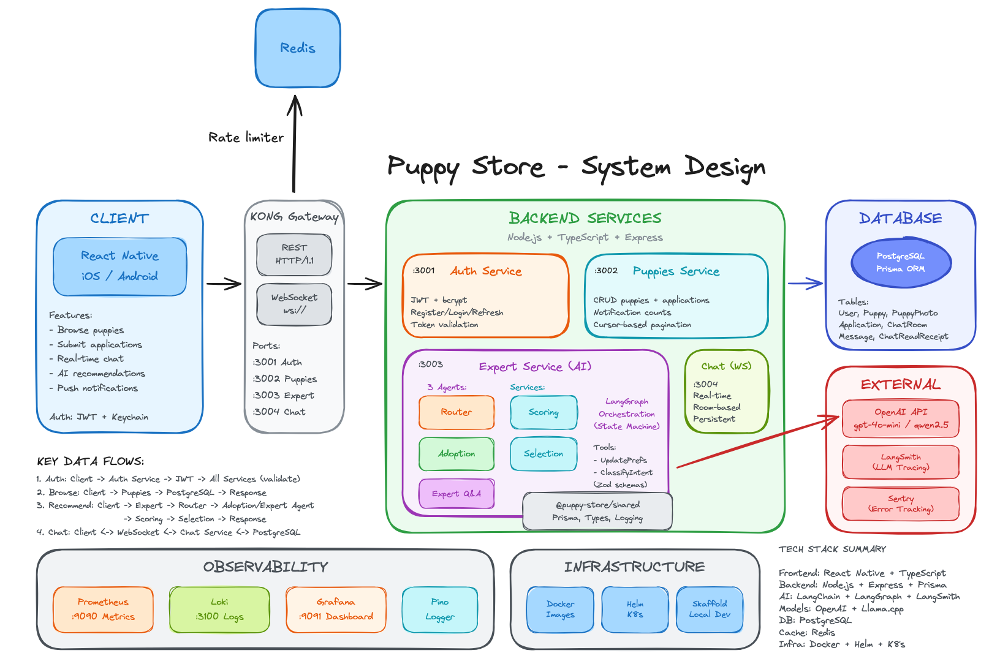
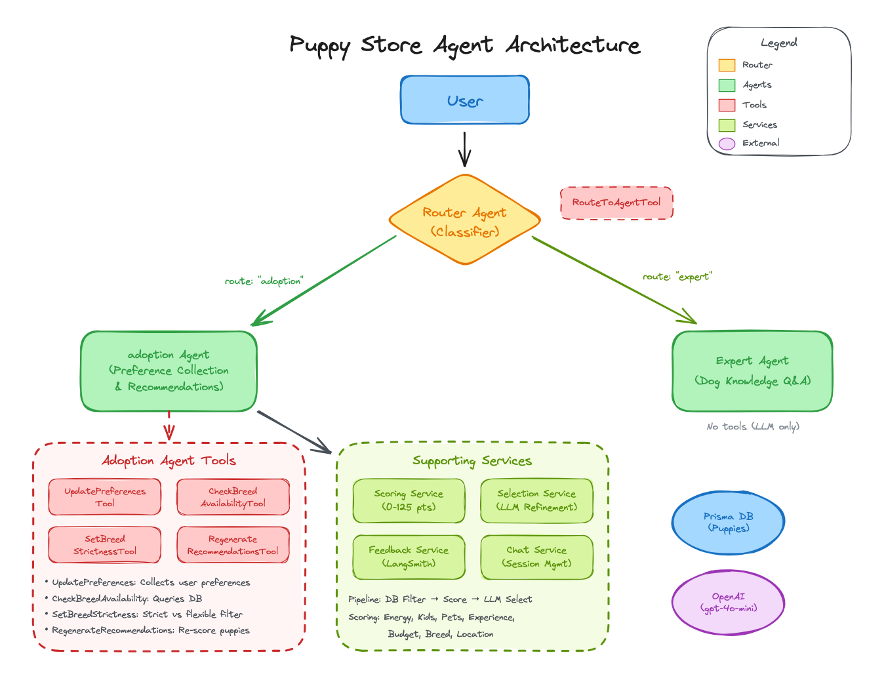
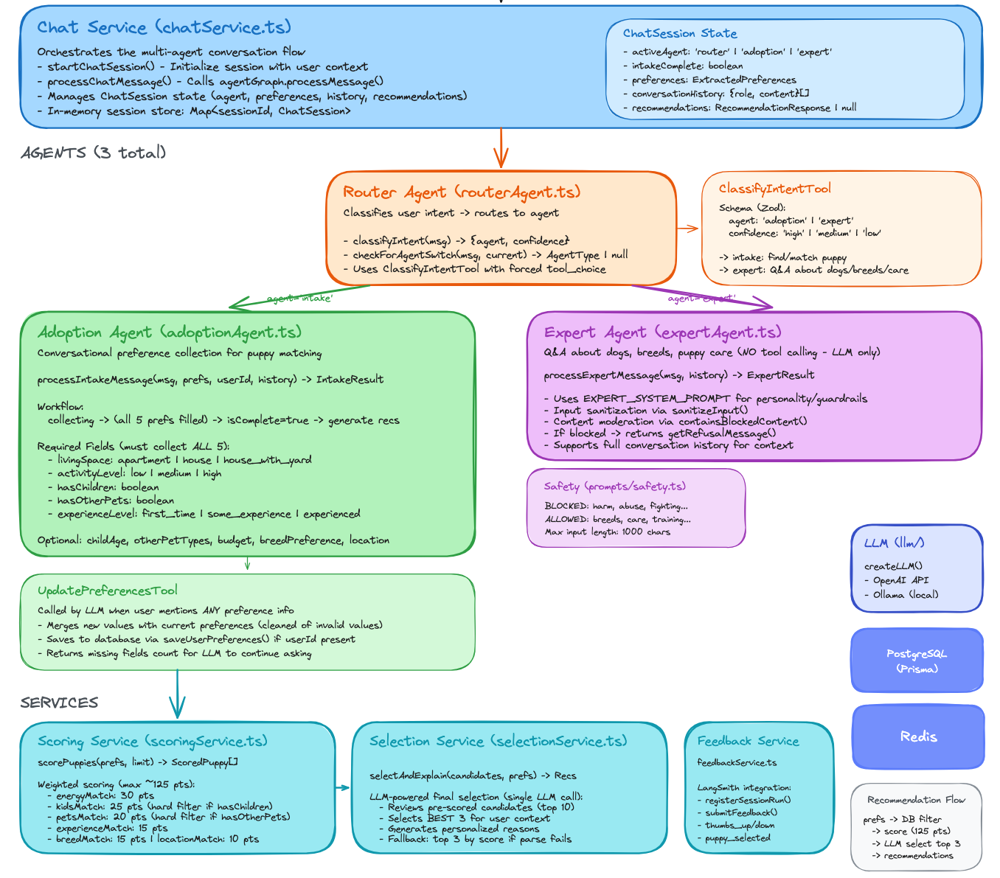
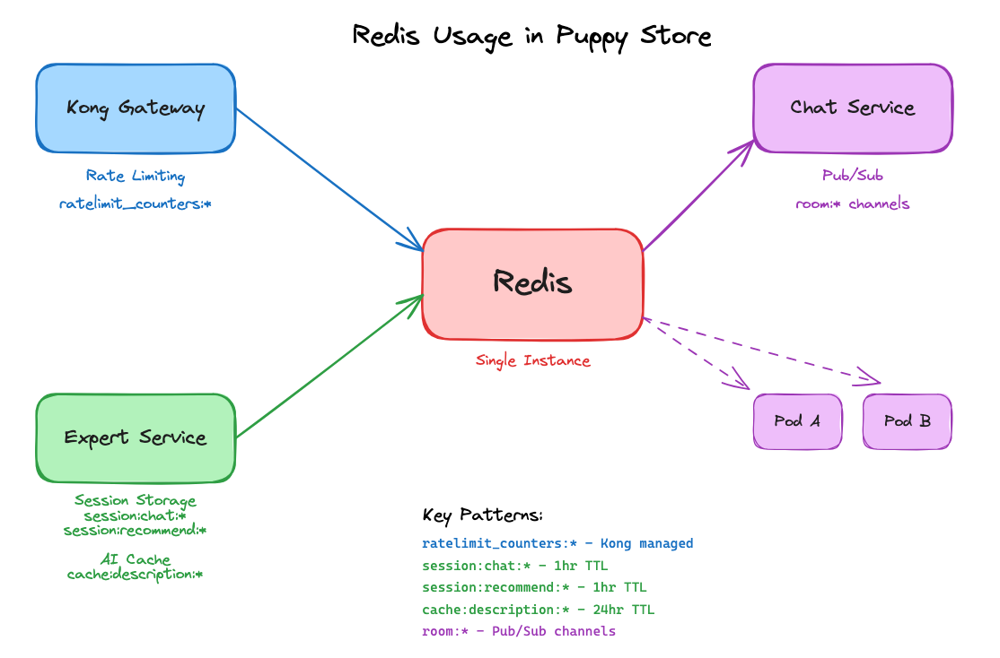

# Puppy Store

[](https://github.com/alexfsmn/puppy-store/actions/workflows/backend.yaml)
[](https://github.com/alexfsmn/puppy-store/actions/workflows/mobile.yml)

An AI-powered puppy adoption platform with a React Native mobile app and microservices backend.

<table>
  <tr>
    <td></td>
    <td></td>
    <td></td>
    <td></td>
  </tr>
</table>



## What it does

- **Adoption Assistant**: AI chat that learns your preferences and recommends matching puppies
- **Expert Q&A**: Ask questions about breeds, care, training, and puppy health
- **Browse & Apply**: View available puppies and submit adoption applications

## Agent Architecture Overview



### Agent Specification



### Session & Cache Architecture



```
PuppyStore/          # React Native mobile app (iOS/Android)
backend/
  packages/
    auth/            # JWT authentication
    puppies/         # Puppy listings & applications
    expert/          # LangGraph AI agents (adoption + expert)
    chat/            # WebSocket chat relay
    shared/          # Prisma client, observability, types
infra/               # Terraform (AKS, PostgreSQL, Key Vault)
helm/                # Kubernetes deployment charts
```

## Quick Start

### Prerequisites

- Node.js 20+
- Docker Desktop with Kubernetes enabled
- Helm (`brew install helm`)
- Skaffold (`brew install skaffold`)

### Backend (Kubernetes)

```bash
cp backend/.env.example backend/.env         # Configure OPENAI_API_KEY (or use local LLM)
./scripts/dev.sh                             # Builds, deploys, and watches for changes
```

This runs all services in Kubernetes with hot-reload. Services available at:
- Auth: http://localhost:3001
- Puppies: http://localhost:3002
- Expert: http://localhost:3003
- Chat: ws://localhost:3004

To seed the database with sample puppies and users:

```bash
./scripts/seed-db.sh
```

### Local LLM (optional)

To use a local model instead of OpenAI:

```bash
./scripts/run-llama-cpp.sh                   # Starts llama.cpp server on :11434
```

Then set `LLM_PROVIDER=local` in your backend `.env`.

To use a different model, set `LOCAL_LLM_MODEL` in `.env` or pass the path as an argument.

### Mobile App

```bash
cd PuppyStore
npm install
npx pod-install             # iOS only
npm run ios                 # or: npm run android
```

## Deployment

Pushes to `main` trigger the GitHub Actions workflow which:
1. Builds Docker images for each service
2. Pushes to Azure Container Registry
3. Deploys to AKS via Helm

## Tech Stack

| Layer | Tech |
|-------|------|
| Mobile | React Native, TypeScript |
| Backend | Node.js, Express, Prisma |
| API Gateway | Kong (JWT auth, rate limiting, routing) |
| AI | LangChain, LangGraph, OpenAI |
| Database | PostgreSQL (with pgvector) |
| Cache | Redis (rate limiting, sessions, pub/sub) |
| Infra | Terraform, Helm, AKS |
| Observability | Sentry, LangSmith, Prometheus |
| Security | Helmet, JWT, bcrypt |

## Documentation

- [Systems Design Thinking](systems_design_thinking.md) - Architectural decisions, trade-offs, and reasoning
